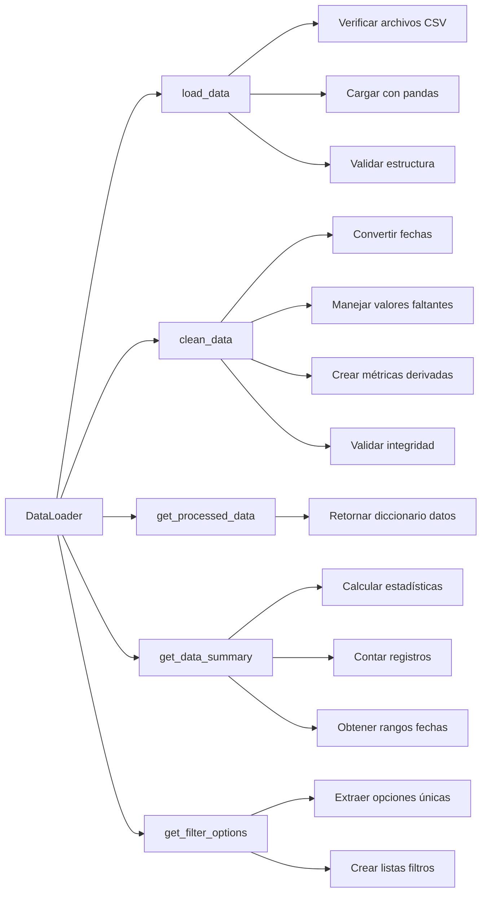
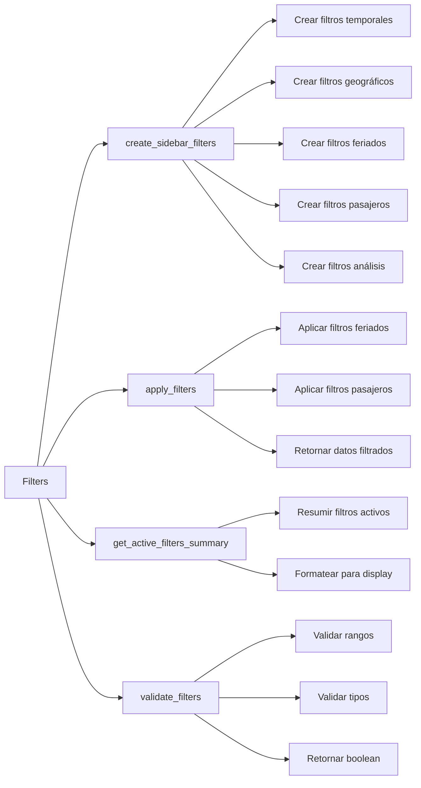
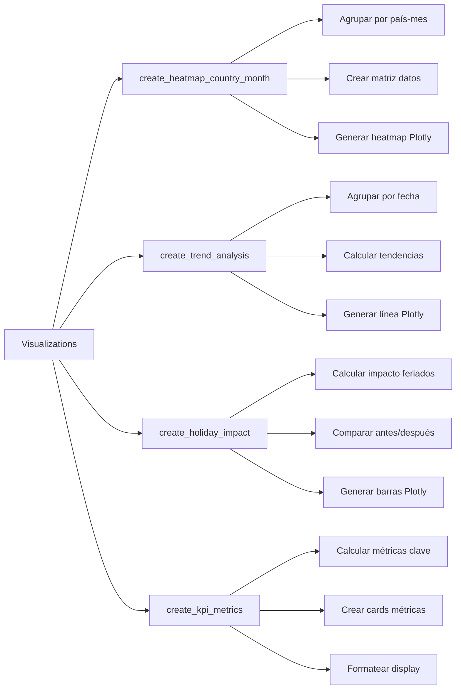
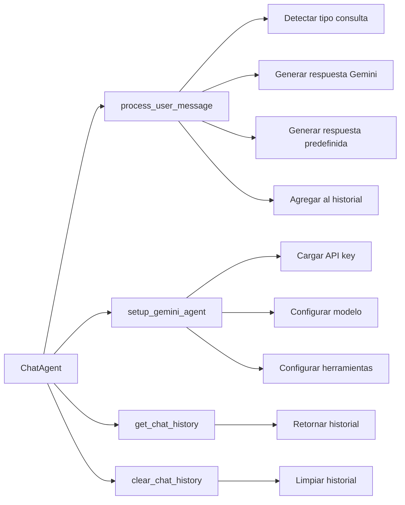
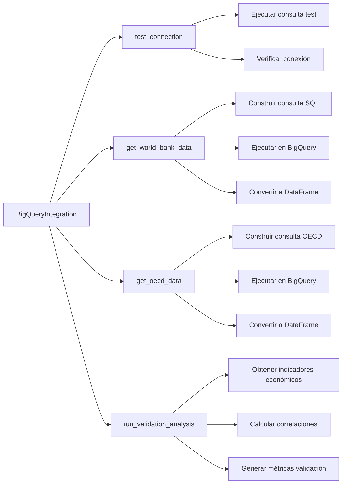
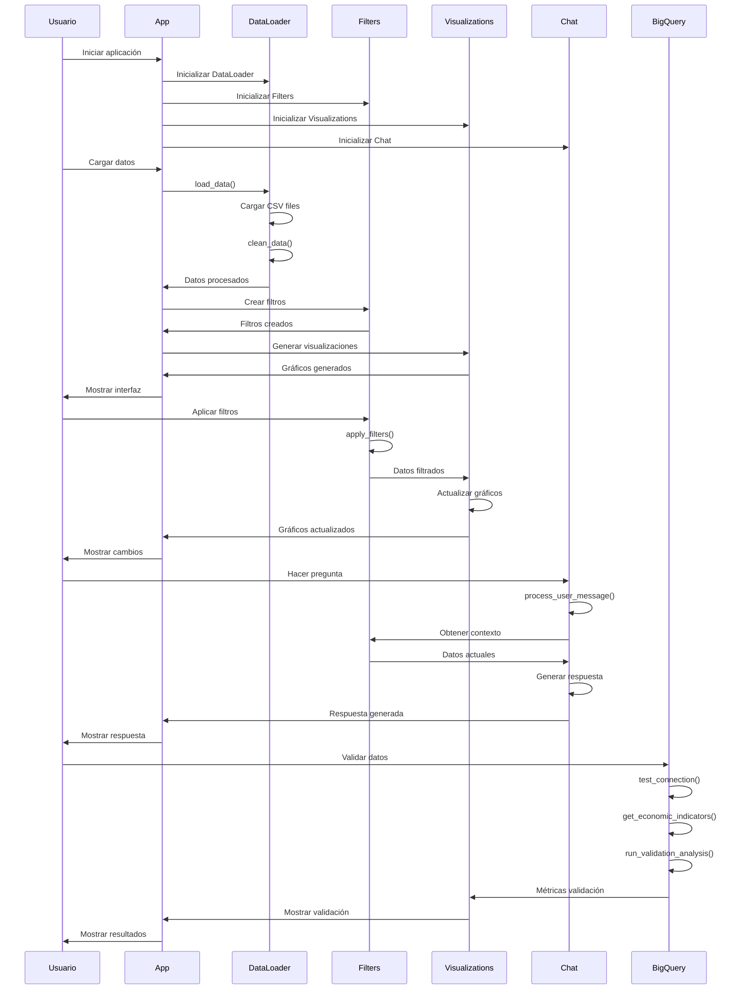
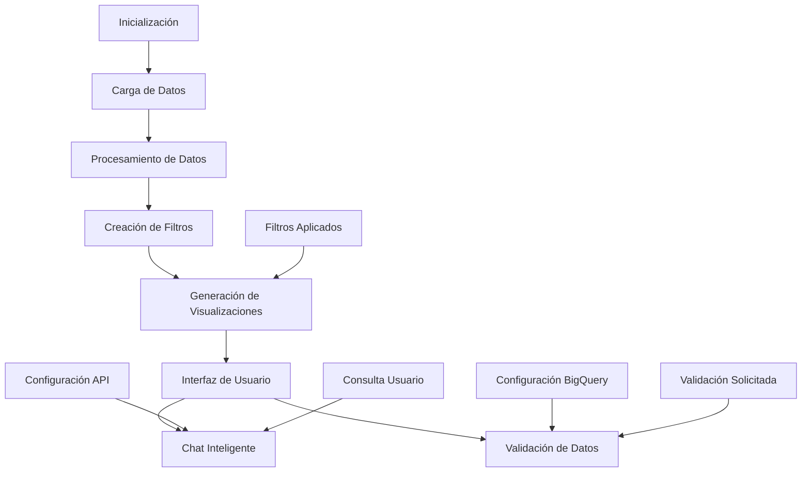

# Árbol de Tareas del Sistema DataRush

## Estructura Jerárquica de Tareas

```mermaid
graph TD
    A[DataRush - Análisis de Patrones de Feriados] --> B[1. Inicialización del Sistema]
    A --> C[2. Carga y Procesamiento de Datos]
    A --> D[3. Interfaz de Usuario]
    A --> E[4. Análisis y Visualización]
    A --> F[5. Chat Inteligente]
    A --> G[6. Validación de Datos]
    A --> H[7. Exportación y Reportes]
    
    B --> B1[1.1 Configurar Streamlit]
    B --> B2[1.2 Inicializar Session State]
    B --> B3[1.3 Cargar Variables de Entorno]
    B --> B4[1.4 Configurar Componentes]
    
    C --> C1[2.1 Cargar Archivos CSV]
    C --> C2[2.2 Procesar Datos de Feriados]
    C --> C3[2.3 Procesar Datos de Pasajeros]
    C --> C4[2.4 Procesar Datos de Países]
    C --> C5[2.5 Limpiar y Validar Datos]
    C --> C6[2.6 Crear Métricas Derivadas]
    
    C1 --> C1a[2.1.1 Cargar global_holidays.csv]
    C1 --> C1b[2.1.2 Cargar monthly_passengers.csv]
    C1 --> C1c[2.1.3 Cargar countries.csv]
    
    C2 --> C2a[2.2.1 Convertir fechas]
    C2 --> C2b[2.2.2 Extraer año, mes, día]
    C2 --> C2c[2.2.3 Calcular día de semana]
    
    C3 --> C3a[2.3.1 Manejar valores faltantes]
    C3 --> C3b[2.3.2 Convertir tipos de datos]
    C3 --> C3c[2.3.3 Crear fechas compuestas]
    
    C4 --> C4a[2.4.1 Mapear códigos ISO3]
    C4 --> C4b[2.4.2 Crear diccionario países]
    C4 --> C4c[2.4.3 Validar integridad]
    
    D --> D1[3.1 Crear Sidebar]
    D --> D2[3.2 Crear Layout Principal]
    D --> D3[3.3 Crear Tabs de Visualización]
    D --> D4[3.4 Crear Interfaz de Chat]
    
    D1 --> D1a[3.1.1 Botón Cargar Datos]
    D1 --> D1b[3.1.2 Resumen de Datos]
    D1 --> D1c[3.1.3 Filtros Avanzados]
    
    D2 --> D2a[3.2.1 Columna Visualizaciones 70%]
    D2 --> D2b[3.2.2 Columna Chat 30%]
    
    D3 --> D3a[3.3.1 Tab Tendencias]
    D3 --> D3b[3.3.2 Tab Comparación]
    D3 --> D3c[3.3.3 Tab Impacto]
    D3 --> D3d[3.3.4 Tab Resumen]
    
    E --> E1[4.1 Crear Filtros]
    E --> E2[4.2 Aplicar Filtros]
    E --> E3[4.3 Generar Visualizaciones]
    E --> E4[4.4 Calcular Métricas]
    
    E1 --> E1a[4.1.1 Filtros Temporales]
    E1 --> E1b[4.1.2 Filtros Geográficos]
    E1 --> E1c[4.1.3 Filtros de Feriados]
    E1 --> E1d[4.1.4 Filtros de Pasajeros]
    E1 --> E1e[4.1.5 Filtros de Análisis]
    
    E1a --> E1a1[4.1.1.1 Slider Año]
    E1a --> E1a2[4.1.1.2 Multiselect Mes]
    E1a --> E1a3[4.1.1.3 Select Período Feriado]
    
    E1b --> E1b1[4.1.2.1 Multiselect Países]
    E1b --> E1b2[4.1.2.2 Multiselect Continentes]
    
    E1c --> E1c1[4.1.3.1 Multiselect Tipo Feriado]
    E1c --> E1c2[4.1.3.2 Multiselect Categoría Cultural]
    
    E1d --> E1d1[4.1.4.1 Multiselect Tipo Vuelo]
    E1d --> E1d2[4.1.4.2 Slider Volumen Pasajeros]
    
    E1e --> E1e1[4.1.5.1 Multiselect Impacto]
    E1e --> E1e2[4.1.5.2 Multiselect Patrón Temporal]
    
    E3 --> E3a[4.3.1 Mapa de Calor Países-Meses]
    E3 --> E3b[4.3.2 Gráfico Líneas Tendencias]
    E3 --> E3c[4.3.3 Gráfico Barras Impacto]
    E3 --> E3d[4.3.4 Métricas KPI]
    
    E4 --> E4a[4.4.1 Total Pasajeros]
    E4 --> E4b[4.4.2 Total Feriados]
    E4 --> E4c[4.4.3 Países Analizados]
    E4 --> E4d[4.4.4 Mes Pico]
    
    F --> F1[5.1 Configurar Gemini API]
    F --> F2[5.2 Procesar Consultas]
    F --> F3[5.3 Generar Respuestas]
    F --> F4[5.4 Mantener Historial]
    
    F1 --> F1a[5.1.1 Cargar API Key]
    F1 --> F1b[5.1.2 Configurar Modelo]
    F1 --> F1c[5.1.3 Configurar Herramientas]
    
    F2 --> F2a[5.2.1 Detectar Tipo Consulta]
    F2 --> F2b[5.2.2 Enrutar a Herramienta]
    F2 --> F2c[5.2.3 Obtener Contexto]
    
    F3 --> F3a[5.3.1 Respuesta Gemini]
    F3 --> F3b[5.3.2 Respuesta Predefinida]
    F3 --> F3c[5.3.3 Formatear Respuesta]
    
    F4 --> F4a[5.4.1 Almacenar Mensajes]
    F4 --> F4b[5.4.2 Limpiar Historial]
    F4 --> F4c[5.4.3 Mostrar Historial]
    
    G --> G1[6.1 Conectar BigQuery]
    G --> G2[6.2 Obtener Datos Externos]
    G --> G3[6.3 Calcular Correlaciones]
    G --> G4[6.4 Generar Métricas Validación]
    
    G1 --> G1a[6.1.1 Configurar Credenciales]
    G1 --> G1b[6.1.2 Probar Conexión]
    G1 --> G1c[6.1.3 Crear Dataset]
    
    G2 --> G2a[6.2.1 Consultar World Bank]
    G2 --> G2b[6.2.2 Consultar OECD]
    G2 --> G2c[6.2.3 Combinar Datos]
    
    G3 --> G3a[6.3.1 Correlación Oficial-OS]
    G3 --> G3b[6.3.2 Correlación Oficial-PIB]
    G3 --> G3c[6.3.3 Correlación OS-PIB]
    
    G4 --> G4a[6.4.1 Score Completitud]
    G4 --> G4b[6.4.2 Score Consistencia]
    G4 --> G4c[6.4.3 Score Confiabilidad]
    
    H --> H1[7.1 Exportar Datos]
    H --> H2[7.2 Generar Reportes]
    H --> H3[7.3 Guardar Configuraciones]
    
    H1 --> H1a[7.1.1 Exportar CSV]
    H1 --> H1b[7.1.2 Exportar Excel]
    H1 --> H1c[7.1.3 Exportar JSON]
    
    H2 --> H2a[7.2.1 Reporte Ejecutivo]
    H2 --> H2b[7.2.2 Reporte Técnico]
    H2 --> H2c[7.2.3 Reporte Validación]
    
    H3 --> H3a[7.3.1 Guardar Filtros]
    H3 --> H3b[7.3.2 Guardar Visualizaciones]
    H3 --> H3c[7.3.3 Guardar Chat]
```

## Detalle de Tareas por Componente

### 1. DataLoader Component

### 2. Filters Component

### 3. Visualizations Component

### 4. Chat Agent Component

### 5. BigQuery Integration Component

## Flujo de Ejecución de Tareas

## Métricas de Rendimiento por Tarea

| Tarea | Tiempo Promedio | Estado | Prioridad |
|-------|----------------|--------|-----------|
| Carga de datos | 0.03s | ✅ Excelente | Alta |
| Limpieza de datos | 0.02s | ✅ Excelente | Alta |
| Creación de filtros | 0.17s | ✅ Excelente | Media |
| Generación visualizaciones | <0.02s | ✅ Excelente | Alta |
| Procesamiento chat | 0.5-2s | ✅ Bueno | Media |
| Validación BigQuery | 2-5s | ✅ Bueno | Baja |
| Testing completo | 1.34s | ✅ Excelente | Alta |

## Dependencias entre Tareas

## Estados de Tareas

- **Pendiente**: Tarea no iniciada
- **En Progreso**: Tarea ejecutándose
- **Completada**: Tarea finalizada exitosamente
- **Error**: Tarea falló, requiere intervención
- **Pausada**: Tarea pausada temporalmente
- **Cancelada**: Tarea cancelada por el usuario

