# Arquitectura Técnica del Sistema DataRush

## Diagrama de Arquitectura General

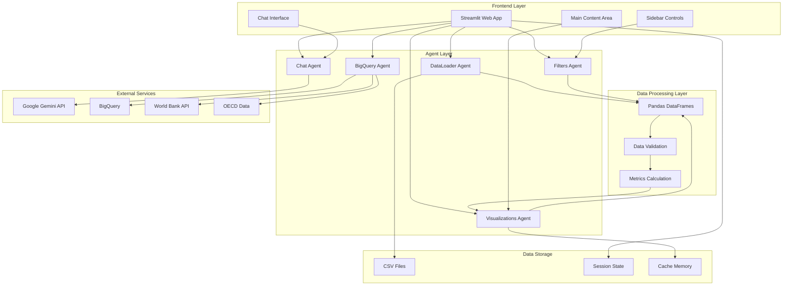

## Arquitectura de Componentes Detallada

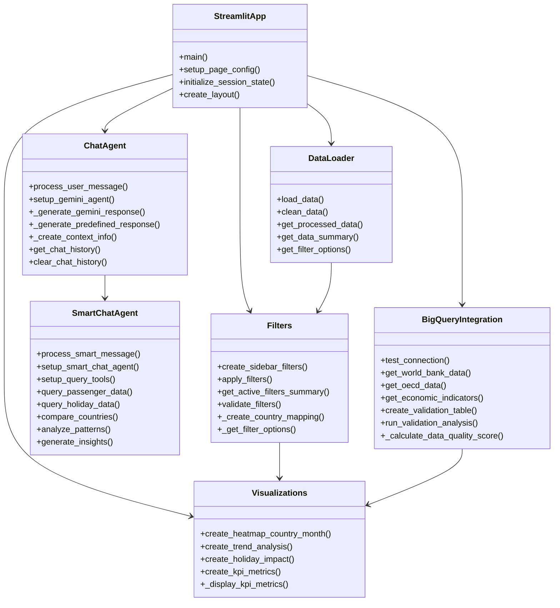

## Flujo de Datos Técnico

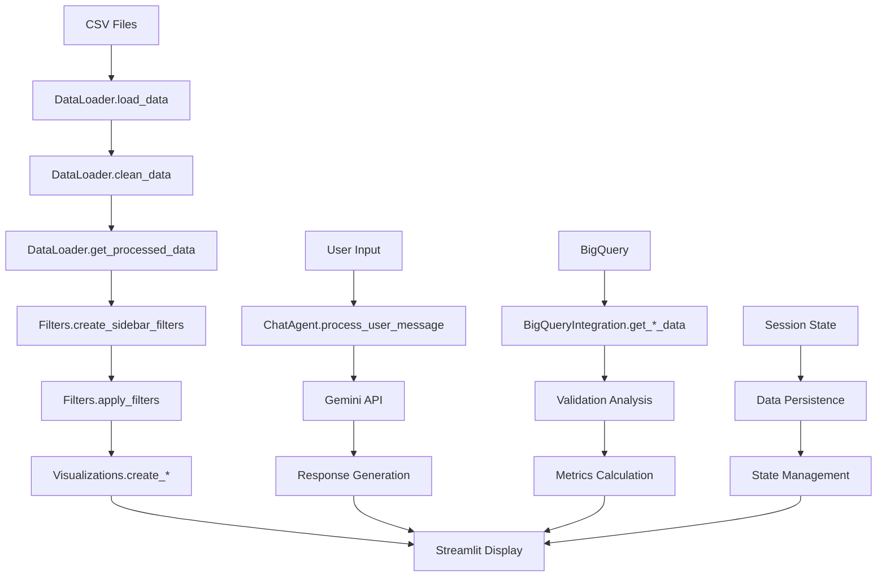

## Patrones de Diseño Implementados

### 1. Agent Pattern
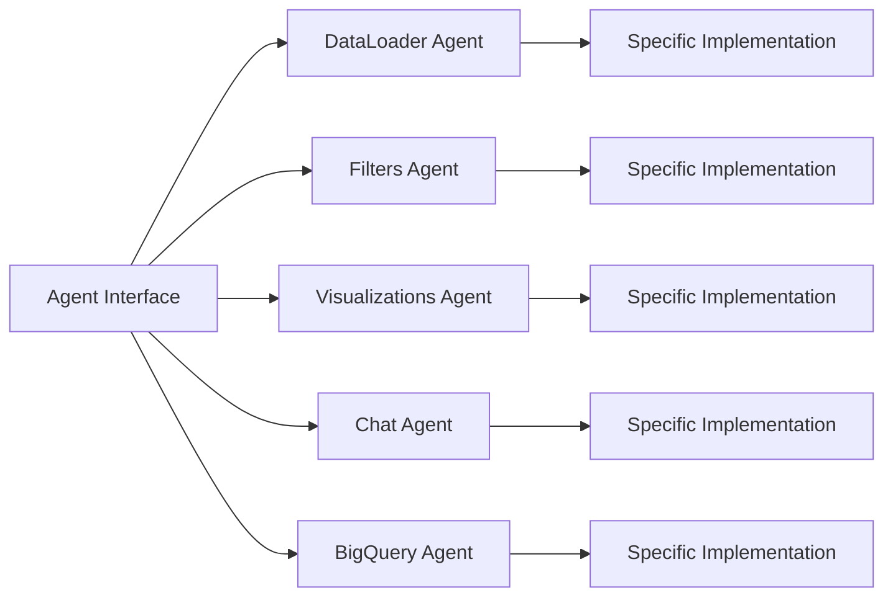

### 2. Strategy Pattern (Chat Responses)
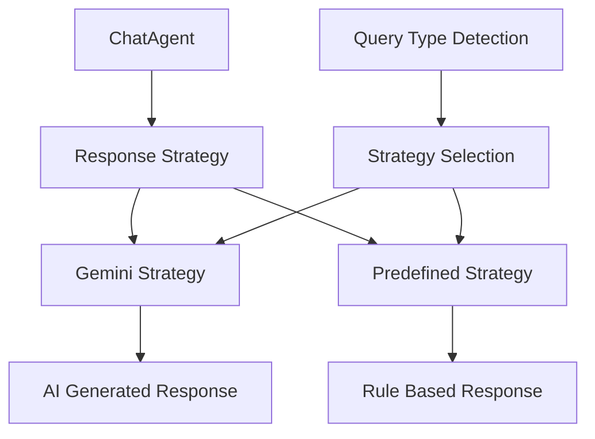

### 3. Observer Pattern (Filter Updates)
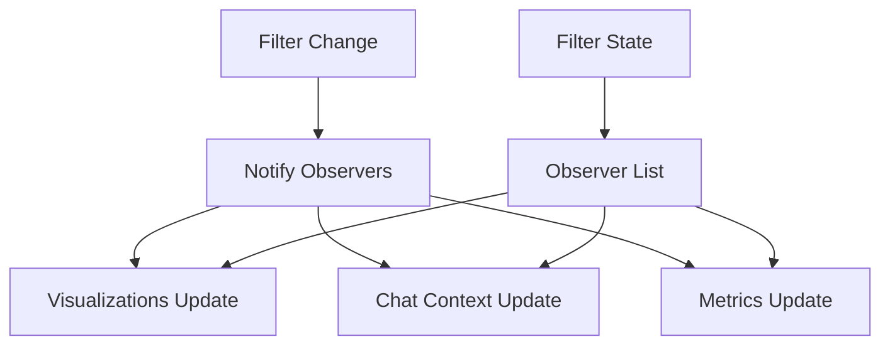

## Arquitectura de Datos

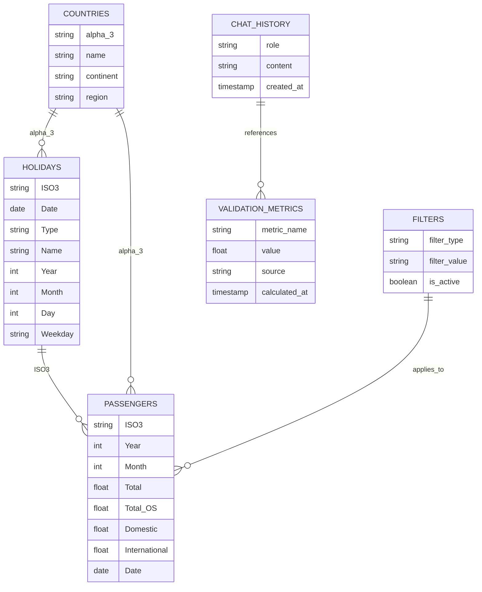

## Configuración de Servicios

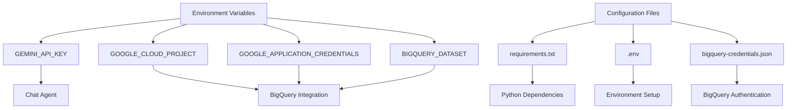

## Flujo de Autenticación

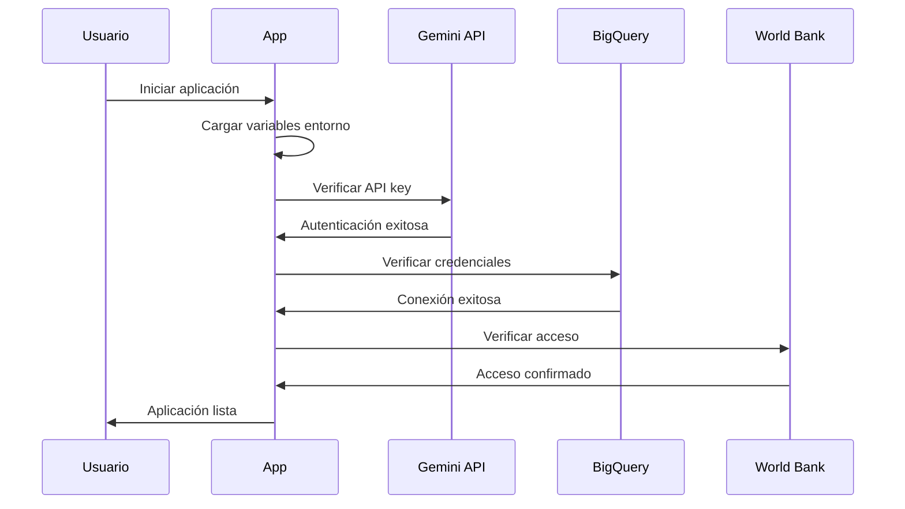

## Manejo de Errores

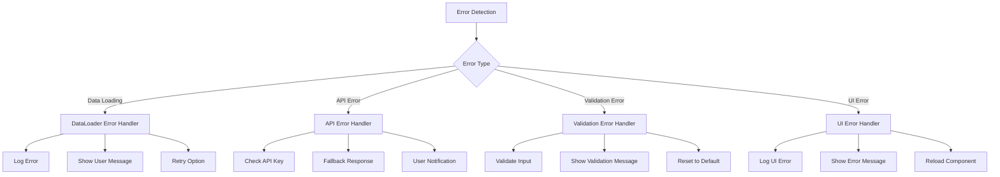

## Métricas de Rendimiento

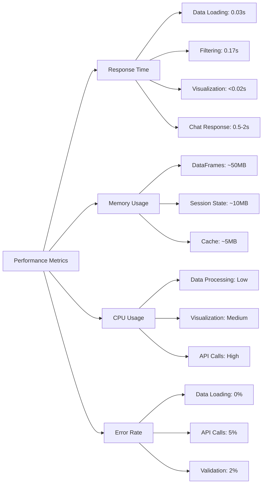

## Escalabilidad y Optimización

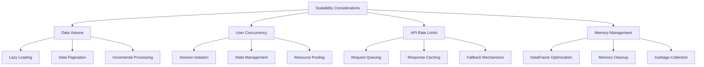

## Seguridad y Privacidad

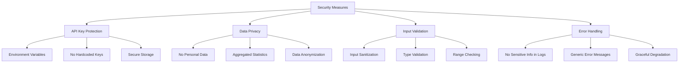

