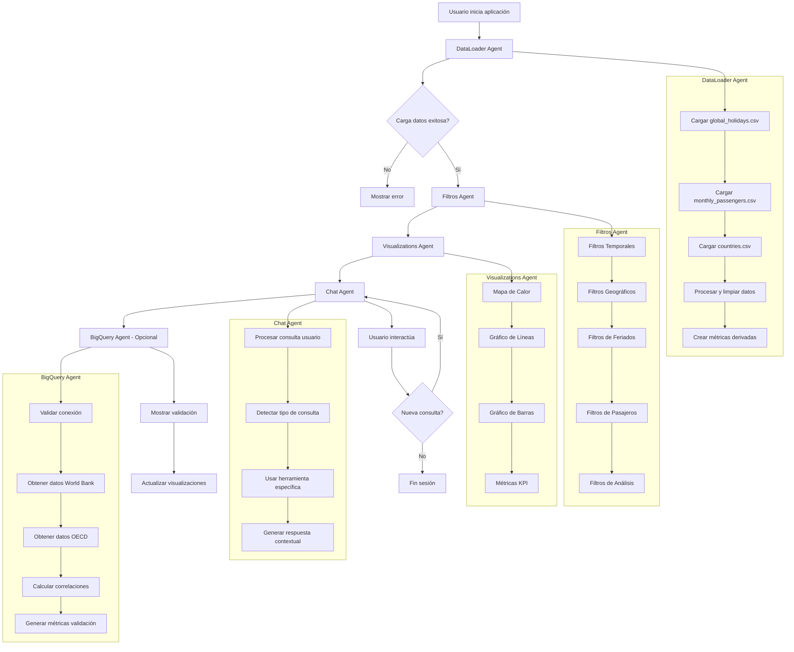
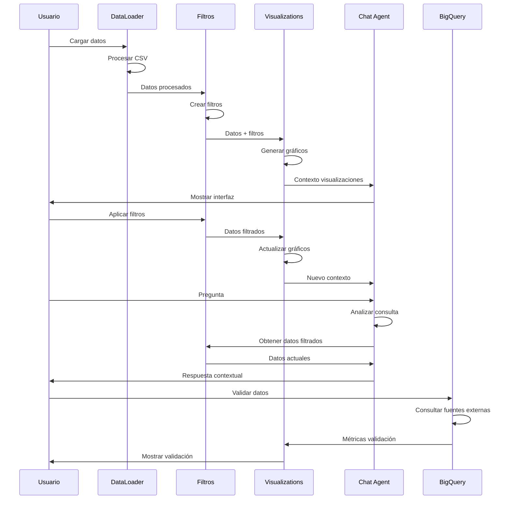
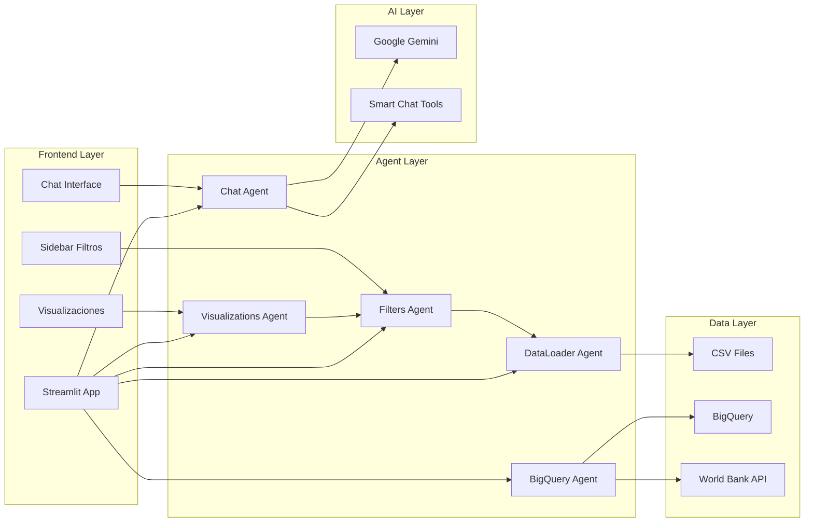
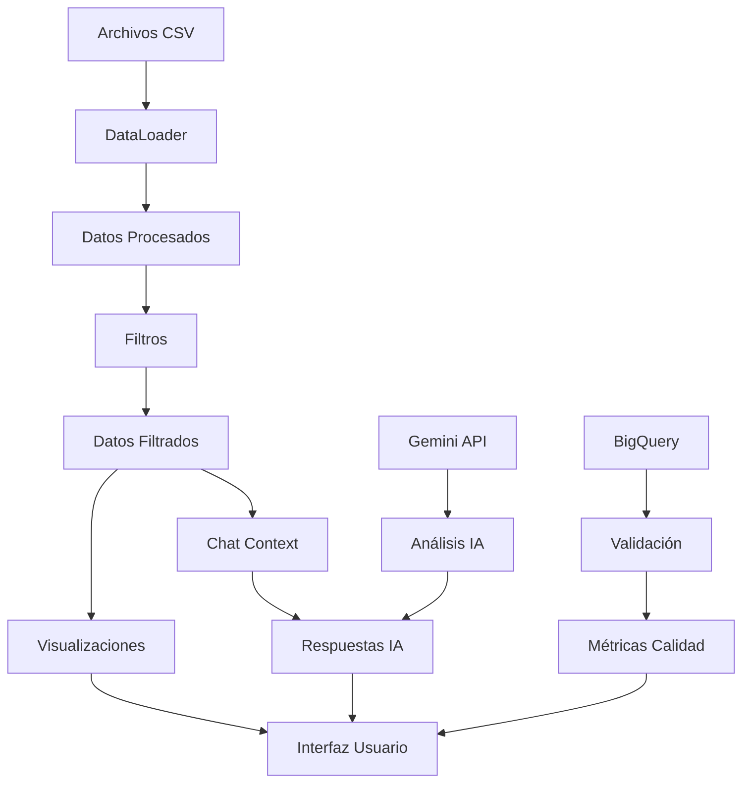
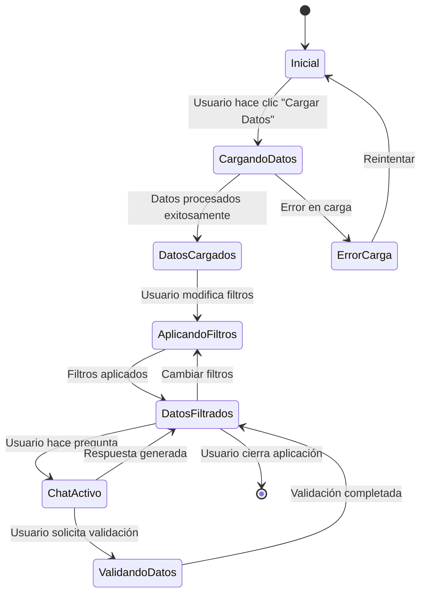

# Diagrama de Flujo de Tareas Multiagente - DataRush

## Flujo de Trabajo Multiagente

## Interacciones entre Agentes

## Arquitectura de Componentes

## Flujo de Datos

## Estados del Sistema

## Tareas por Agente

### DataLoader Agent
- Cargar archivos CSV
- Validar integridad de datos
- Limpiar y procesar datos
- Crear métricas derivadas
- Manejar errores de carga

### Filters Agent
- Crear interfaz de filtros
- Aplicar filtros temporales
- Aplicar filtros geográficos
- Aplicar filtros de feriados
- Aplicar filtros de pasajeros
- Validar filtros

### Visualizations Agent
- Generar mapa de calor
- Crear gráficos de líneas
- Crear gráficos de barras
- Calcular métricas KPI
- Actualizar visualizaciones

### Chat Agent
- Procesar consultas del usuario
- Detectar tipo de consulta
- Enrutar a herramienta específica
- Generar respuestas contextuales
- Mantener historial de chat

### BigQuery Agent
- Validar conexión
- Obtener datos externos
- Calcular correlaciones
- Generar métricas de validación
- Manejar errores de conexión
