# 🔍 Research Agent - Diagrama de Capacidades

## Arquitectura del Research Agent

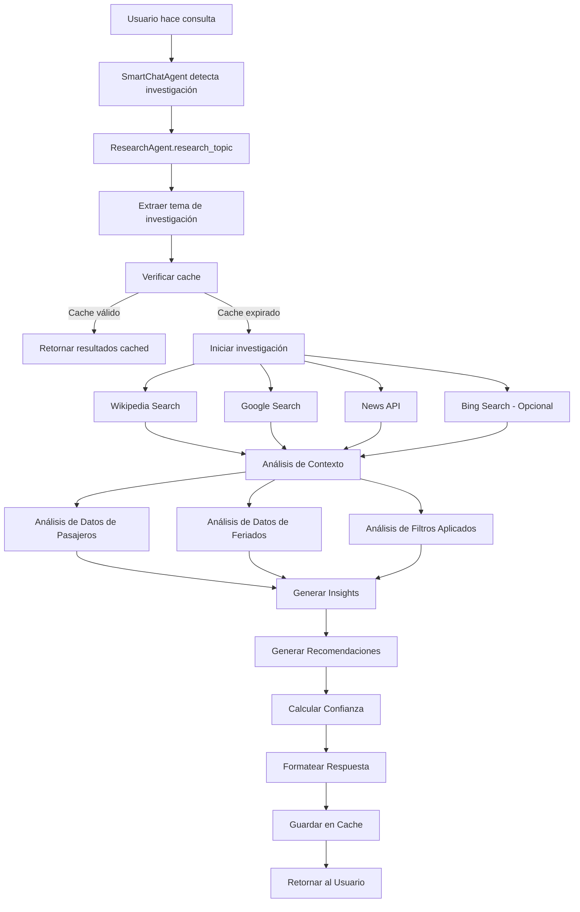

## Flujo de Investigación Detallado

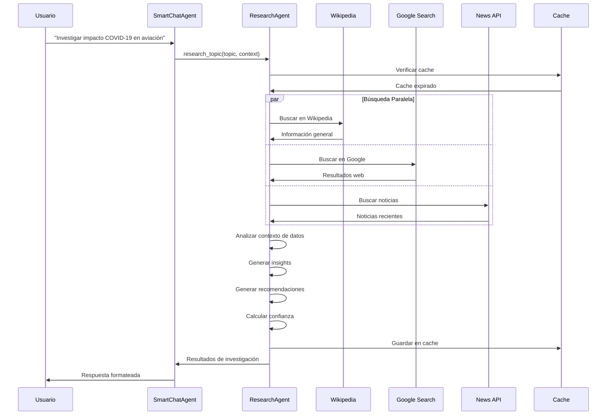

## Fuentes de Información

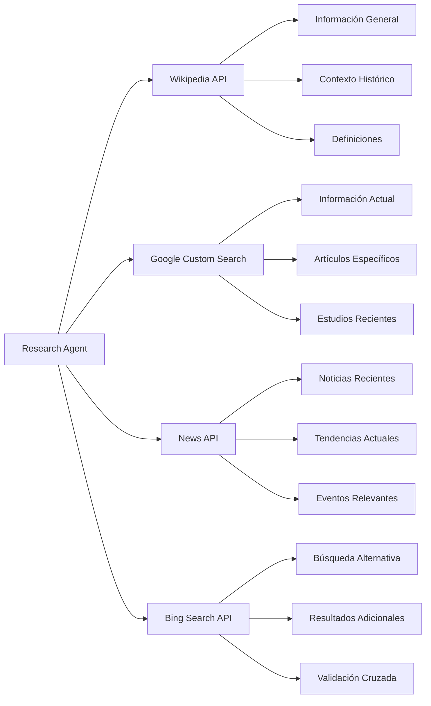

## Análisis de Contexto

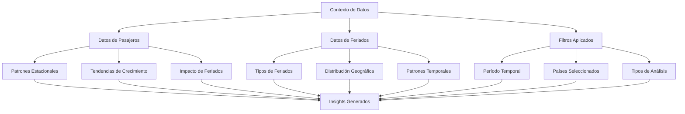

## Generación de Respuestas

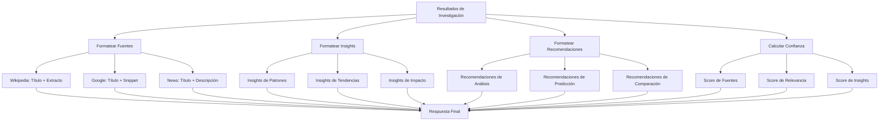

## Configuración de APIs

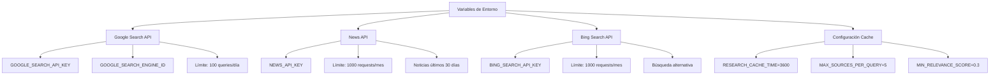

## Métricas de Rendimiento

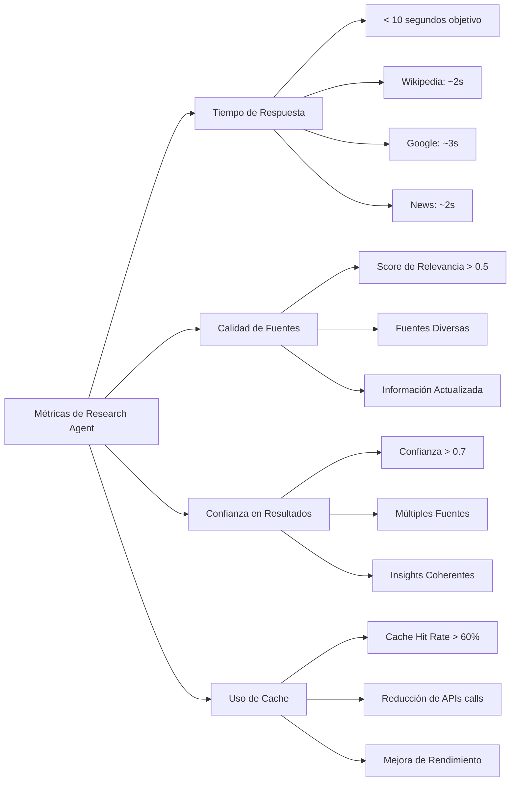

## Casos de Uso del Research Agent

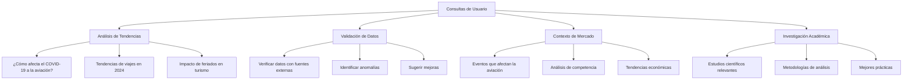

## Integración con SmartChatAgent

```mermaid
graph TD
    A[SmartChatAgent] --> B[Detectar Palabras Clave]
    B --> C{¿Es consulta de investigación?}
    C -->|Sí| D[Activar ResearchAgent]
    C -->|No| E[Usar herramientas normales]
    
    D --> F[research_topic()]
    F --> G[Procesar múltiples fuentes]
    G --> H[Generar respuesta contextual]
    H --> I[Formatear para chat]
    I --> J[Retornar al usuario]
    
    E --> K[query_passenger_data]
    E --> L[query_holiday_data]
    E --> M[compare_countries]
    E --> N[analyze_patterns]
    E --> O[generate_insights]
```

## Palabras Clave de Activación

```mermaid
graph LR
    A[Palabras Clave] --> B[investigar]
    A --> C[investigación]
    A --> D[buscar información]
    A --> E[fuentes externas]
    A --> F[información sobre]
    A --> G[datos sobre]
    A --> H[estudios sobre]
    A --> I[investigaciones sobre]
    
    B --> J[Activar ResearchAgent]
    C --> J
    D --> J
    E --> J
    F --> J
    G --> J
    H --> J
    I --> J
```

## Flujo de Cache

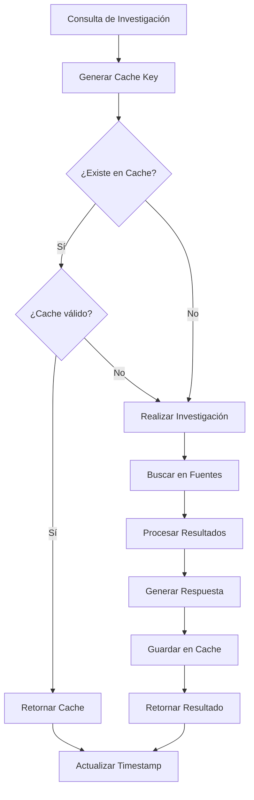

## Configuración de Relevancia

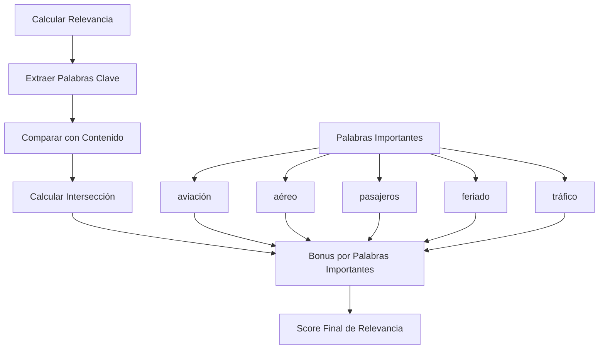

Este Research Agent convierte al sistema DataRush en una herramienta mucho más inteligente y completa, capaz de proporcionar información contextual y actualizada cuando los datos internos no son suficientes para responder las consultas del usuario.

