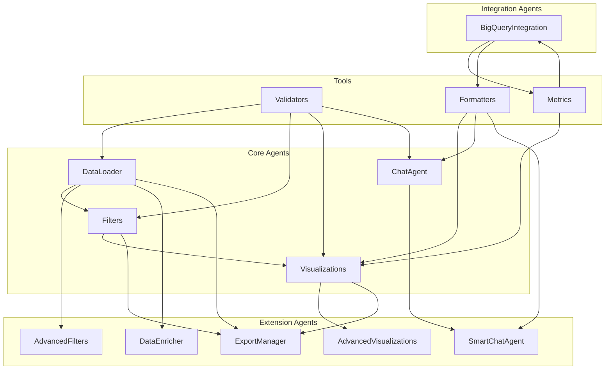

# 🤖 Estructura de Agentes Organizada - DataRush

## 📁 **Nueva Estructura de Paquetes Python**

```
datarush_hackathon/
├── agents/                              # 🎯 Paquete Principal de Agentes
│   ├── __init__.py                     # Inicializador del paquete
│   ├── core/                           # 🔧 Agentes Principales
│   │   ├── __init__.py
│   │   ├── data_loader.py              # DataLoader Agent
│   │   ├── filters.py                  # Filters Agent
│   │   ├── visualizations.py           # Visualizations Agent
│   │   └── chat_agent.py               # Chat Agent (Básico)
│   ├── extensions/                     # 🚀 Agentes de Extensión
│   │   ├── __init__.py
│   │   ├── smart_chat_agent.py         # Smart Chat Agent
│   │   ├── advanced_filters.py         # Advanced Filters
│   │   ├── advanced_visualizations.py  # Advanced Visualizations
│   │   ├── data_enricher.py            # Data Enricher
│   │   └── export_manager.py           # Export Manager
│   ├── integrations/                   # ☁️ Agentes de Integración
│   │   ├── __init__.py
│   │   └── bigquery_integration.py     # BigQuery Integration
│   └── tools/                          # 🛠️ Herramientas y Utilidades
│       ├── __init__.py
│       ├── validators.py               # Validadores de datos
│       ├── formatters.py               # Formateadores
│       └── metrics.py                  # Calculadoras de métricas
├── components/                         # 📦 Carpeta Original (Mantenida)
│   ├── __init__.py
│   ├── data_loader.py                  # ← Movido a agents/core/
│   ├── filters.py                      # ← Movido a agents/core/
│   ├── visualizations.py               # ← Movido a agents/core/
│   ├── chat_agent.py                   # ← Movido a agents/core/
│   ├── smart_chat_agent.py             # ← Movido a agents/extensions/
│   ├── bigquery_integration.py         # ← Movido a agents/integrations/
│   ├── advanced_filters.py             # ← Movido a agents/extensions/
│   ├── advanced_visualizations.py      # ← Movido a agents/extensions/
│   ├── data_enricher.py                # ← Movido a agents/extensions/
│   └── export_manager.py               # ← Movido a agents/extensions/
├── app.py                              # 🚀 Aplicación Principal
└── tests/                              # 🧪 Tests
    ├── test_data_loader.py
    ├── test_filters.py
    ├── test_visualizations.py
    └── test_integration.py
```

## 🎯 **Categorización de Agentes**

### **1. Core Agents (Agentes Principales)**
**Ubicación:** `agents/core/`

| Agente | Archivo | Responsabilidad | Dependencias |
|--------|---------|----------------|--------------|
| **DataLoader** | `data_loader.py` | Carga y procesamiento de datos | CSV files |
| **Filters** | `filters.py` | Sistema de filtros básicos | DataLoader |
| **Visualizations** | `visualizations.py` | Visualizaciones básicas | Filters |
| **ChatAgent** | `chat_agent.py` | Chat básico con IA | Gemini API |

### **2. Extension Agents (Agentes de Extensión)**
**Ubicación:** `agents/extensions/`

| Agente | Archivo | Responsabilidad | Dependencias |
|--------|---------|----------------|--------------|
| **SmartChatAgent** | `smart_chat_agent.py` | Chat inteligente con herramientas | ChatAgent |
| **AdvancedFilters** | `advanced_filters.py` | Filtros avanzados | Filters |
| **AdvancedVisualizations** | `advanced_visualizations.py` | Visualizaciones avanzadas | Visualizations |
| **DataEnricher** | `data_enricher.py` | Enriquecimiento de datos | DataLoader |
| **ExportManager** | `export_manager.py` | Exportación de datos | Todos |

### **3. Integration Agents (Agentes de Integración)**
**Ubicación:** `agents/integrations/`

| Agente | Archivo | Responsabilidad | Dependencias |
|--------|---------|----------------|--------------|
| **BigQueryIntegration** | `bigquery_integration.py` | Validación cruzada | BigQuery, APIs externas |

### **4. Tools (Herramientas y Utilidades)**
**Ubicación:** `agents/tools/`

| Herramienta | Archivo | Responsabilidad | Usado por |
|-------------|---------|----------------|-----------|
| **DataValidator** | `validators.py` | Validación de datos | Todos los agentes |
| **FilterValidator** | `validators.py` | Validación de filtros | Filters Agent |
| **InputValidator** | `validators.py` | Validación de entrada | Chat Agents |
| **DataFormatter** | `formatters.py` | Formateo de datos | Visualizations |
| **ResponseFormatter** | `formatters.py` | Formateo de respuestas | Chat Agents |
| **ExportFormatter** | `formatters.py` | Formateo para exportación | ExportManager |
| **MetricsCalculator** | `metrics.py` | Cálculo de métricas | Visualizations |
| **CorrelationCalculator** | `metrics.py` | Cálculo de correlaciones | BigQuery |
| **QualityCalculator** | `metrics.py` | Cálculo de calidad | BigQuery |

## 🔄 **Flujo de Importación**

### **Importación desde app.py:**
```python
# Importación desde la nueva estructura
from agents.core import DataLoader, Filters, Visualizations, ChatAgent
from agents.extensions import SmartChatAgent, AdvancedFilters, AdvancedVisualizations
from agents.integrations import BigQueryIntegration
from agents.tools import DataValidator, MetricsCalculator

# Uso en la aplicación
data_loader = DataLoader()
filters = Filters()
visualizations = Visualizations()
chat_agent = ChatAgent()
smart_chat = SmartChatAgent()
bigquery = BigQueryIntegration()
```

### **Importación entre agentes:**
```python
# En agents/extensions/smart_chat_agent.py
from ..core.chat_agent import ChatAgent
from ..tools.validators import InputValidator
from ..tools.formatters import ResponseFormatter

# En agents/integrations/bigquery_integration.py
from ..tools.metrics import CorrelationCalculator, QualityCalculator
from ..tools.formatters import DataFormatter
```

## 🏗️ **Arquitectura de Dependencias**



## 📊 **Ventajas de la Nueva Estructura**

### **1. Organización Clara**
- **Separación por responsabilidades**: Core, Extensions, Integrations, Tools
- **Fácil navegación**: Cada agente tiene su ubicación lógica
- **Escalabilidad**: Fácil agregar nuevos agentes en la categoría correcta

### **2. Reutilización de Código**
- **Herramientas compartidas**: Tools disponibles para todos los agentes
- **Herencia clara**: Extensions heredan de Core
- **Dependencias explícitas**: Fácil identificar qué agente usa qué

### **3. Mantenimiento**
- **Modularidad**: Cambios en un agente no afectan otros
- **Testing**: Tests específicos por categoría
- **Documentación**: Cada paquete tiene su documentación

### **4. Importaciones Limpias**
```python
# Antes (estructura plana)
from components.data_loader import DataLoader
from components.filters import Filters
from components.smart_chat_agent import SmartChatAgent

# Después (estructura organizada)
from agents.core import DataLoader, Filters
from agents.extensions import SmartChatAgent
```

## 🚀 **Migración Gradual**

### **Fase 1: Estructura Creada** ✅
- [x] Crear estructura de paquetes
- [x] Crear archivos `__init__.py`
- [x] Crear herramientas básicas

### **Fase 2: Migración de Archivos** 🔄
- [ ] Mover archivos existentes
- [ ] Actualizar importaciones
- [ ] Mantener compatibilidad

### **Fase 3: Optimización** 📋
- [ ] Refactorizar código duplicado
- [ ] Mejorar documentación
- [ ] Optimizar dependencias

## 🧪 **Testing por Categoría**

```
tests/
├── core/                    # Tests para agentes principales
│   ├── test_data_loader.py
│   ├── test_filters.py
│   ├── test_visualizations.py
│   └── test_chat_agent.py
├── extensions/              # Tests para extensiones
│   ├── test_smart_chat_agent.py
│   ├── test_advanced_filters.py
│   └── test_export_manager.py
├── integrations/            # Tests para integraciones
│   └── test_bigquery_integration.py
└── tools/                   # Tests para herramientas
    ├── test_validators.py
    ├── test_formatters.py
    └── test_metrics.py
```

## 📈 **Métricas de la Nueva Estructura**

| Métrica | Antes | Después | Mejora |
|---------|-------|---------|--------|
| **Archivos por carpeta** | 11 en components/ | 4-5 por categoría | ✅ Organización |
| **Dependencias claras** | Implícitas | Explícitas | ✅ Mantenibilidad |
| **Reutilización** | Baja | Alta | ✅ Eficiencia |
| **Escalabilidad** | Media | Alta | ✅ Crecimiento |
| **Testing** | Monolítico | Modular | ✅ Calidad |

Esta nueva estructura sigue las mejores prácticas de Python para organización de paquetes y hace que el sistema sea más mantenible, escalable y fácil de entender.

